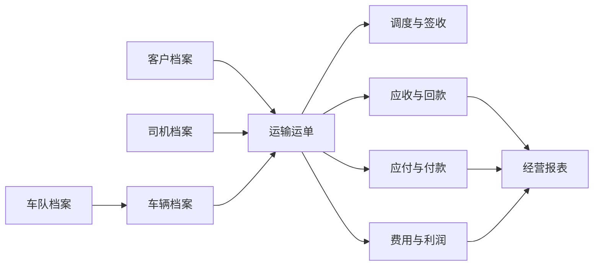

# 小微物流企业一体化记账系统开发方案

## 1. 项目定位

本系统面向小微物流公司，将接单、调度、运输、签收、对账、收付款、费用、发票和经营分析放在同一套系统中，减少重复录入和业务、财务数据脱节。

当前 V2 为可交互本地原型，保留原系统主要功能，并重点优化操作路径、运输业务联动、移动端适配和经营数据展示。

## 2. 建设目标

1. 一张运单贯穿接单、派车、签收、应收、应付和利润核算。
2. 起点、终点精确到区县，自动计算预估里程。
3. 常用客户资料一键带入，减少重复录单。
4. 提供客户、司机、记账三种留存联。
5. 车辆、司机、车队分别建档，支持灵活调度。
6. 经营数据实时汇总，帮助老板掌握欠款、现金流和线路利润。
7. 提供独立普通账号会话，支持错误提示、刷新恢复、明确退出和财务授权联动撤销。

## 3. 核心功能

### 3.1 经营总览

- 本月应收、已收、逾期金额、经营毛利；
- 收支趋势、资金动态和重点待办；
- 高风险应收和到期提醒；
- 客户、线路、运力等经营指标。

### 3.2 运单管理

- 新建、查询、筛选、导出运单；
- 维护客户、货物、收发货联系人和详细地址；
- 起点、终点按省、市、区县三级选择；
- 自动估算两地运输里程；
- 司机、车辆均为可选项，默认不填写，可在调度时补充；
- 需要司机或车辆时，可选择已有档案，也可在运单内现场录入并选择是否保存到档案；
- 记录包装、件数、重量、体积、声明价值等货物明细；
- 记录基础运费、保险费、装卸费、上楼费、其他费用、承运成本和预估毛利；
- 记录付款方式、结算方式和交付方式；
- 推进待调度、运输中、已签收、已结算状态。

### 3.3 常用客户

- 保存客户名称、联系人、电话和常发货物；
- 保存常用装货、卸货区县和详细地址；
- 新建运单时一键带入全部资料；
- 发货信息、收货信息分别使用独立识别模块，防止联系人和地址串填；
- 支持粘贴微信、短信中的发货或收货信息，自动识别联系人、电话、地址和区县；
- 支持在发货、收货两个独立模块中导入高德分享文字、地点链接、坐标链接和短链接；带坐标但不带文字地址时，可通过可选的高德 Web 服务 Key 反查省市区县及详细地址；
- 运单查询兼容复制内容中的空格、换行和隐藏字符，并覆盖运单号、客户、路线、司机和车辆；
- 顶部全局搜索自动识别 `WB` 运单号并跳转到运单结果，整段粘贴内容会优先提取运单编号；
- 支持客户信用、账期、开票资料和历史线路扩展。

### 3.4 调度、车辆与车队

- 待调度、运输中、已签收看板；
- 车辆独立建档：车牌、车型、车长、核载、来源、状态；
- 司机独立建档，不与车辆建立固定绑定；
- 每次运输任务单独选择司机和车辆；
- 支持自有车辆、合作车队、临时外请；
- 车队档案记录联系人、电话和可调车辆池。

### 3.5 三联运输单

- 第一联：客户留存，显示客户运费；
- 第二联：司机留存，显示承运结算金额；
- 第三联：记账留存，显示收入、成本和预估毛利；
- 三联使用同一运单编号，便于追溯；
- 左侧显示发货人或发货公司，右侧显示收货人，运输及货物信息在下方集中展示；
- 司机和车辆只有在实际填写后才生成对应字段，未填写时不出现空栏；
- 车辆填写后展示车牌、车型和车长，司机填写后展示姓名和联系电话；
- 包含付款、结算、交付、费用明细、人民币大写、约定事项和签字盖章栏；
- 不显示道路运输经营许可证示例号；
- 支持 A4 纵向预览和打印。

### 3.6 财务管理

- 应收、应付、回款和付款；
- 自动核销和未核销余额；
- 客户对账单和差额跟踪；
- 油费、过路费、维修费、装卸费等费用登记；
- 资金流水、发票和业务单据关联；
- 应收、应付、回款、付款、对账、费用、资金流水、发票和财务经营报表统一归入财务专属区；
- 进入财务专属区前必须完成财务密钥验证，直接访问财务页面地址也必须执行权限校验；
- 未授权状态隐藏全部财务菜单、金额列和财务操作，只显示财务登录入口；授权成功后动态展示，退出财务模式后立即收起；
- 普通账号退出时同时清除普通账号会话和财务授权，直接访问业务或财务页面时分别执行账号校验和财务二次校验；
- 未授权人员仅使用运输业务，经营首页和运单列表不展示应收、利润、收入、成本及资金流水；
- 普通运输人员开具运单时不强制填写运费和承运成本，开单成功后直接生成三联单；财务费用由授权人员后续处理；
- 财务授权采用会话机制，可主动退出，关闭页面后自动失效；
- 正式生产版由服务端完成身份认证、角色权限、密钥散列、失败锁定、审计日志和密钥轮换。
- 应收账龄、客户贡献和线路毛利报表。

## 4. 关键业务设计

### 4.1 数据关系

车辆与司机没有固定绑定关系。司机仅在某次运输任务中与车辆临时关联，任务结束后车辆重新进入可调度状态。

### 4.2 自动里程

当前原型根据区县中心点经纬度计算球面距离，再乘道路修正系数得到预估里程。该方式无需地图密钥，适合演示和初步报价。

生产版本建议接入地图驾驶路线服务，输入装货和卸货详细地址，返回真实道路里程、预计时长、过路费和推荐线路。系统应同时保留“系统计算里程”和“人工确认里程”，以人工确认值作为结算依据。

地址导入采用“浏览器本地识别＋本地服务解析”的分层方式：普通地址和带参数的长链接优先本地识别；高德短链接由受限域名白名单服务展开；需要把纯坐标转换为结构化地址时，调用高德地理/逆地理编码接口。发货与收货分别处理并只写入各自字段。

### 4.3 财务联动

1. 运单确认客户运费后生成应收草稿。
2. 确认承运成本后生成司机或承运商应付草稿。
3. 签收回单完成后，允许进入对账和结算。
4. 收款、付款登记后自动核销对应单据。
5. 运单收入减承运成本及相关费用，形成单票毛利。

## 5. 技术方案

### 5.1 原型版本

- 前端：原生 HTML、CSS、JavaScript；
- 数据：浏览器本地存储；
- 运行：本地静态服务；
- 特点：无须安装前端依赖、可离线演示、启动简单。

### 5.2 生产版本建议

- 前端：Vue 3 或 React；
- 后端：Laravel 或 FastAPI；
- 数据库：MySQL 或 PostgreSQL；
- 缓存与任务：Redis；
- 文件：对象存储，用于回单、合同、发票和凭证；
- 地图：高德、百度或腾讯地图驾驶路线 API；
- 部署：Docker、HTTPS、自动备份和监控。

生产版本必须增加登录、多租户隔离、角色权限、审批、审计日志、数据备份、财务结账和敏感信息保护。

## 6. 分期计划

### 第一阶段：业务闭环

- 客户、司机、车辆、车队档案；
- 运单、调度、签收和回单；
- 应收、应付、收付款和费用；
- 三联单打印；
- 基础经营报表。

### 第二阶段：生产化

- 服务端数据库与附件存储；
- 地图真实路线及里程；
- 角色权限、审批和审计；
- Excel 导入导出、短信或微信提醒；
- 数据备份和恢复。

### 第三阶段：经营智能

- 自动报价和线路成本模型；
- 客户信用和逾期预警；
- 车辆利用率、空驶率和司机绩效；
- 银行流水识别和智能核销；
- 多公司、多账套和移动端司机协同。

## 7. 验收标准

- 常用客户资料能够完整一键带入运单；
- 整段客户文字能够自动识别姓名、电话、装卸地址和区县；
- 起点、终点必须选到区县，系统自动显示预估里程；
- 新建运单后可进入调度、签收和结算流程；
- 三联单准确生成三种留存版本；
- 车辆显示车型、车长和核载，且不固定绑定司机；
- 合作车队可独立维护并用于运单选择；
- 运单收入、成本能联动应收、应付和利润；
- 桌面端和手机端主要页面均可正常使用。

## 8. 当前交付说明

本地访问地址：`http://127.0.0.1:8088/#dashboard`

当前版本为交互原型，不修改原系统和原数据库。演示数据保存在浏览器中，可在“系统设置”里一键恢复。
